<div align="center">

# 🎣 Phishy

### Multi-Signal Email Security Analysis Platform

*Because emails can't be simply classified as "authentic" or "fake"*

[](https://www.python.org/downloads/)
[](https://fastapi.tiangolo.com/)
[](#)
[](#license)


</div>

---

## 💡 Core Philosophy

> **Traditional binary classifiers fail because email authenticity exists on a spectrum.**

Phishy doesn't give you a simple "yes/no" answer. Instead, it evaluates emails across **multiple dimensions** and provides **explainable analysis** using AI, allowing security teams and users to make informed decisions based on nuanced risk assessment.

### Why Multi-Signal Analysis?

Real phishing detection requires evaluating:
- 🔍 **Content patterns** (ML classification with confidence scoring)
- 🌐 **URL reputation** (URLScan.io, Google Safe Browsing)
- 📧 **Sender authenticity** (Email headers, sender reputation)
- 🖥️ **IP intelligence** (AbuseIPDB for sender reputation)
- 📎 **Attachment safety** (File analysis)
- 🤖 **Explainable AI** (LLM-powered reasoning for human understanding)

**Result**: Instead of "This is phishing: TRUE/FALSE", you get risk scores, evidence, and explanations that help users learn *why* an email is suspicious.

---

## 🎯 What is Phishy?

Phishy is a comprehensive cybersecurity training and analysis platform that:

1. **Simulates phishing campaigns** for security awareness training
2. **Analyzes emails** using multiple security signals (not binary classification)
3. **Provides explainable results** via LLM reasoning
4. **Tracks training effectiveness** with detailed analytics
5. **Integrates with Gmail** via Chrome extension for real-time warnings

### The Key Insight

Email security isn't binary. An email from a legitimate domain could still be compromised. A suspicious-looking email might be authentic. **Phishy evaluates multiple matrices and uses explainability to help users understand risk**, rather than creating a simple yes/no classifier.

---

## ✨ Features

### 🔍 Multi-Method Email Analysis

Instead of a single classification, Phishy provides:

- **ML Risk Scoring**: XGBoost classifier with confidence levels (LOW, MEDIUM, HIGH, CRITICAL)
- **Semantic Analysis**: Sentence embeddings detect subtle phishing patterns
- **URL Safety Checks**: Real-time verification against URLScan.io and Google Safe Browsing
- **IP Reputation**: AbuseIPDB integration for sender reputation
- **Header Analysis**: SPF, DKIM, DMARC verification
- **Attachment Scanning**: File safety analysis
- **Explainable AI**: Phi-3 Mini LLM provides human-readable reasoning

### 🤖 AI-Powered Email Generation

Create realistic phishing simulations for training:

- Phi-3 Mini LLM generates contextual phishing emails
- 6+ predefined scenarios (account security, payment requests, rewards, etc.)
- Custom prompt support for specific training needs
- Fallback template system when LLM unavailable

### 📊 Campaign Analytics & Tracking

- Click tracking with geographic and temporal analysis
- Campaign effectiveness metrics
- User vulnerability scoring
- Time-series forecasting (Prophet model)
- PDF report generation

### 🌐 Chrome Extension

Real-time Gmail integration:

- Automatic email scanning on open
- Color-coded risk banners (visual risk indicators)
- Multi-signal analysis results displayed inline
- Explainable AI summaries for each email
- Configuration via popup UI

### 📧 SMTP Integration

Multi-provider email sending:

- Auto-detection of SMTP settings by email domain
- Support: Gmail, Outlook, Yahoo, AOL, ProtonMail, Zoho
- Secure app password authentication
- HTML email support

---

## 🛠️ Tech Stack

**Backend**
- FastAPI 0.104.1 (ASGI web framework)
- Uvicorn 0.24.0 (ASGI server)

**AI/ML**
- XGBoost (multi-class risk classifier)
- sentence-transformers 2.2.0+ (semantic embeddings)
- Phi-3 Mini via Ollama (explainable analysis)
- Prophet (time-series forecasting)
- scikit-learn 1.3.0+ (intent classification)

**Data & Processing**
- Pandas 2.1.4, NumPy 1.24.3
- Pydantic 2.5.0 (validation)
- httpx 0.25.2 (async HTTP)

**Frontend**
- HTML5, CSS3, Vanilla JavaScript
- Chart.js 3.9.1 (visualizations)
- jsPDF 2.5.1 (PDF reports)

**Chrome Extension**
- Manifest V3
- Content Scripts, Service Workers
- Chrome Storage API

**External Services**
- Ollama (local LLM)
- Google Safe Browsing API
- URLScan.io
- AbuseIPDB

---

## 📦 Installation

### Prerequisites

- Python 3.8+
- Ollama (optional, for AI explanations)
- ngrok (optional, for Chrome extension)

### Setup

```bash
# Clone repository
git clone https://github.com/rachuzzzz/Phishy.git
cd Phishy

# Install dependencies
cd backend
pip install -r requirements.txt

# Optional: Install Ollama for AI features
# Download from https://ollama.ai
ollama pull phi3:mini
```

---

## 🚀 Quick Start

### Option 1: Unified Startup (Windows)

```cmd
start.bat
```

Choose mode:
- **Y** = Start with ngrok (required for Chrome extension)
- **N** = Local-only mode

### Option 2: Manual Startup

```bash
# Terminal 1: Start backend
cd backend
python app.py
# Runs at http://localhost:8080

# Terminal 2: Start frontend
cd frontend
python -m http.server 3001
# Runs at http://localhost:3001

# Terminal 3: Start ngrok (for Chrome extension)
ngrok http 8080
# Copy the HTTPS URL
```

---

## ⚙️ Configuration

Create `backend/.env`:

```env
# Server
BACKEND_PORT=8080
FRONTEND_PORT=3001
DEBUG=True

# External APIs (optional)
GOOGLE_SAFE_BROWSING_API_KEY=your_key
URLSCAN_API_KEY=your_key
ABUSEIPDB_API_KEY=your_key
```

### Gmail SMTP Setup

1. **Enable 2FA**: Google Account > Security > 2-Step Verification
2. **Generate App Password**: Security > App passwords > Mail
3. **Use in Phishy**: Use the 16-character app password (NOT regular password)

---

## 📖 Usage

### Generate Phishing Simulation

1. Open `http://localhost:3001`
2. Navigate to **AI Email Generator**
3. Enter target email and scenario
4. Click **Generate**
5. Edit content as needed
6. Configure SMTP and send

**Example prompts:**
```
"Create an urgent account suspension alert"
"Generate a fake IT support password reset request"
"Make a convincing package delivery notification"
```

### Analyze Email (API)

```bash
POST http://localhost:8080/comprehensive/analyze
Content-Type: application/json

{
  "email_content": "Email body text",
  "sender": "sender@example.com",
  "subject": "Email subject",
  "urls": ["https://suspicious-link.com"]
}
```

**Response includes:**
- ML classification with confidence scores
- URL safety results from multiple sources
- IP reputation data
- Sender authentication status
- AI-generated explanation
- Overall risk assessment

### View Analytics

Navigate to **Analytics Dashboard** to see:
- Campaign click-through rates
- User vulnerability patterns
- Geographic distribution
- Time-based trends
- Forecasted attack patterns

---

## 🔌 Chrome Extension Setup

### Installation

1. **Start Phishy with ngrok**
   ```cmd
   start.bat
   # Press Y for ngrok mode
   ```

2. **Get ngrok URL**
   - Find `Forwarding https://xxxx.ngrok-free.app` in ngrok window
   - Copy the HTTPS URL

3. **Load extension in Chrome**
   - Go to `chrome://extensions/`
   - Enable **Developer mode**
   - Click **Load unpacked**
   - Select `chrome-extension/` folder

4. **Configure extension**
   - Click extension icon
   - Enter Gmail address
   - Paste ngrok URL (HTTPS, no trailing slash)
   - Click **Save** then **Test Connection**

5. **Test in Gmail**
   - Open Gmail
   - Open any email
   - See multi-signal analysis banner

### What You'll See

The extension displays:
- **Risk Level**: Color-coded banner (green/yellow/orange/red)
- **ML Confidence**: Classification score
- **URL Analysis**: Results from security APIs
- **Sender Reputation**: IP intelligence data
- **AI Explanation**: Why the email is suspicious or safe
- **Evidence**: Specific indicators found

---

## 📸 Platform Screenshots

### Chat Interface

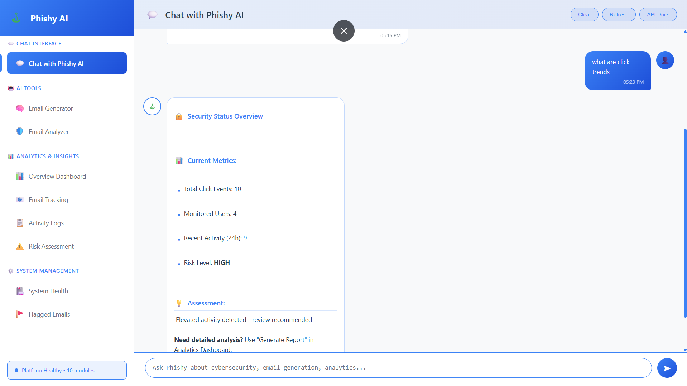

The **Phishy AI Chat Interface** provides conversational access to security analytics. Users can ask natural language questions about click trends, security metrics, and campaign performance. The interface shows real-time security status with metrics like total click events, monitored users, recent activity, and current risk levels.

### AI Email Generator

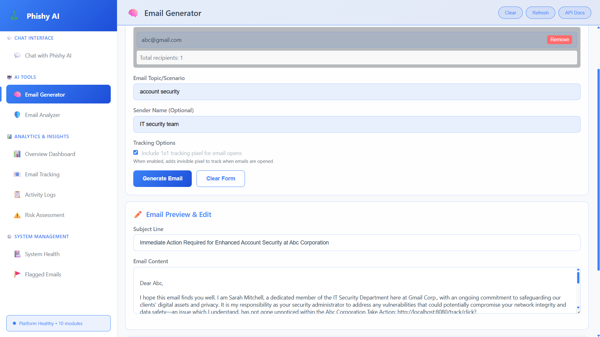

The **Email Generator** allows security teams to create realistic phishing simulations. Simply enter the target email, select a scenario (account security, payment requests, etc.), and optionally customize the sender name. The AI generates contextual phishing emails using Phi-3 Mini LLM.

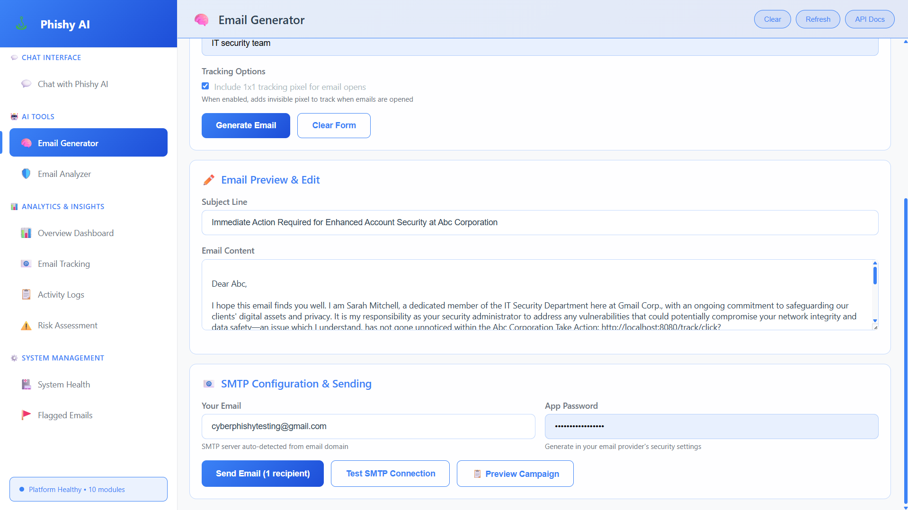

Configure SMTP settings to send training emails. The platform auto-detects SMTP servers from email domains and supports Gmail, Outlook, Yahoo, and more. Preview campaigns before sending and enable 1x1 tracking pixels to monitor email opens.

### Email Analyzer

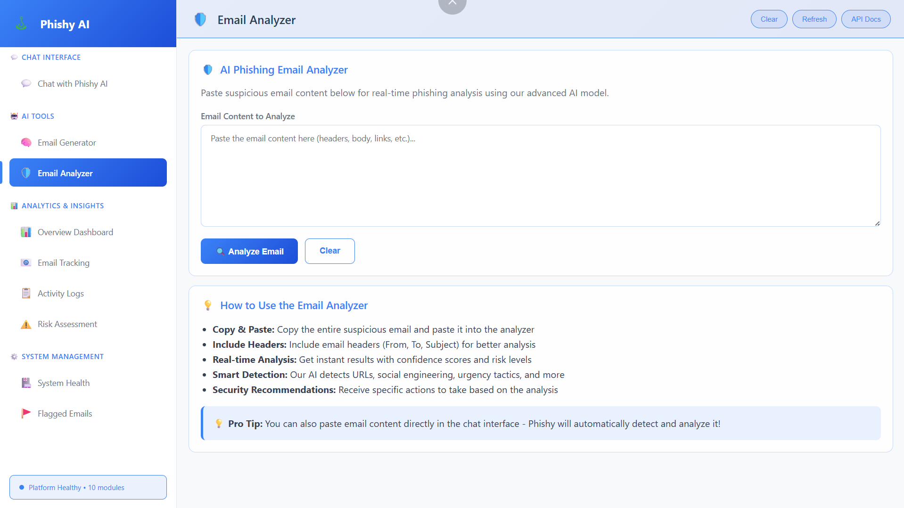

The **Email Analyzer** provides real-time phishing analysis using multi-signal detection. Paste suspicious email content for instant analysis with:
- ML classification with confidence scores
- URL safety verification
- Smart pattern detection (social engineering, urgency tactics)
- Actionable security recommendations

### Overview Dashboard

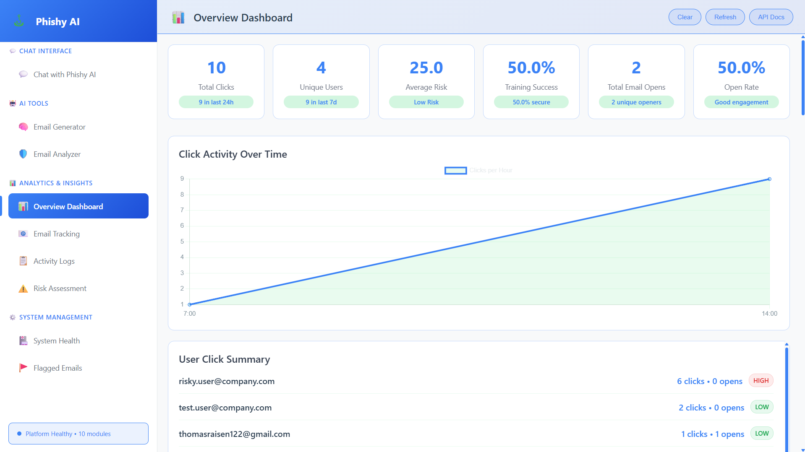

The **Analytics Dashboard** displays comprehensive campaign metrics:
- Total clicks and unique users engaged
- Average risk scores with risk level indicators
- Training success rates
- Email open rates and engagement metrics
- Click activity trends over time
- User-level click summaries with risk ratings

### Analytics Reports

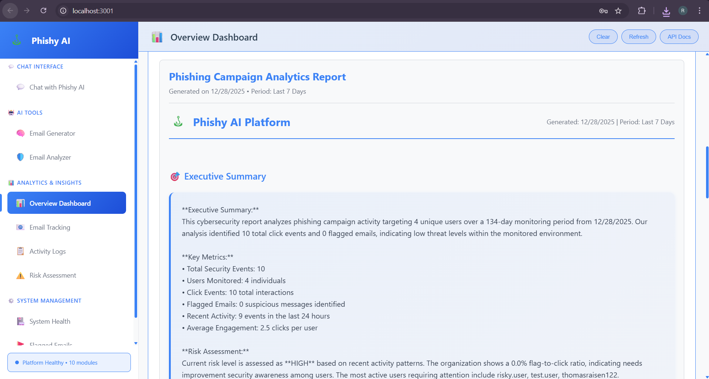

**Phishing Campaign Analytics Reports** provide executive summaries with:
- Total security events and users monitored
- Click event tracking
- Flagged email identification
- Recent activity patterns
- Average engagement rates

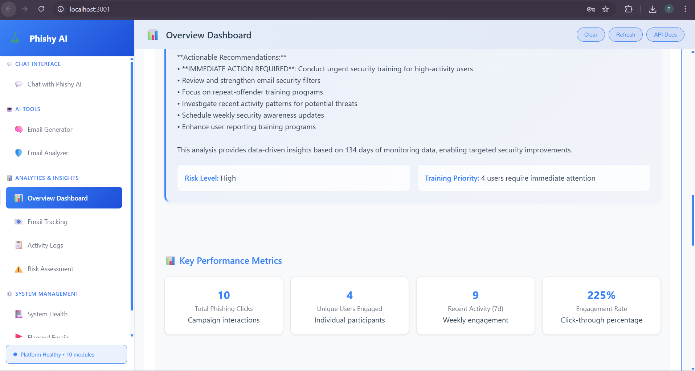

**Actionable Recommendations** are categorized by timeline:
- Immediate actions (0-30 days): Urgent security training for high-risk users
- Medium-term goals (1-3 months): Personalized training modules, security awareness sessions
- Long-term strategy (3+ months): Advanced email filtering, security champion programs

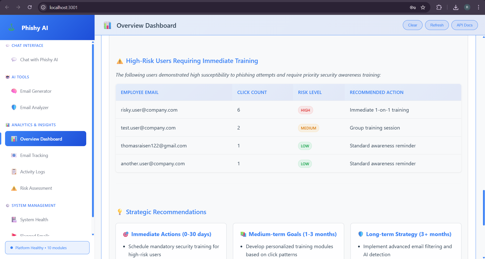

**High-Risk User Identification** table shows:
- Employee emails with click counts
- Risk level classification (HIGH, MEDIUM, LOW)
- Recommended training actions per user

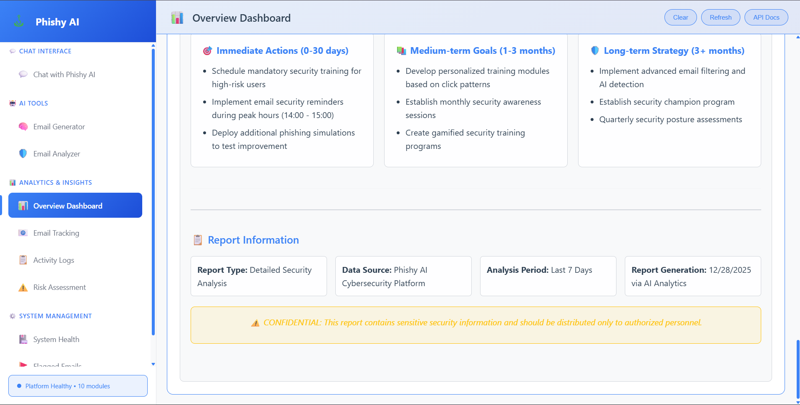

**Key Performance Metrics** display:
- Total phishing clicks (campaign interactions)
- Unique users engaged
- Recent activity (weekly engagement)
- Click-through percentage rates

### Email Tracking

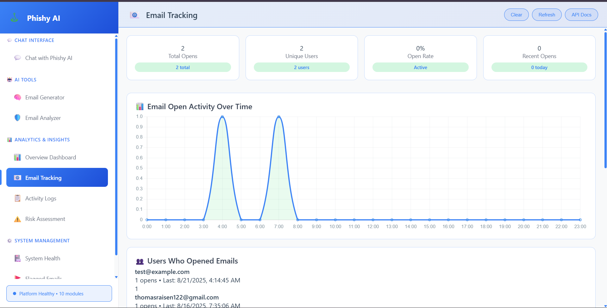

The **Email Tracking** dashboard monitors:
- Total email opens and unique users
- Open rate percentages
- Email open activity over time (hourly breakdown)
- Individual user open timestamps

### Activity Logs

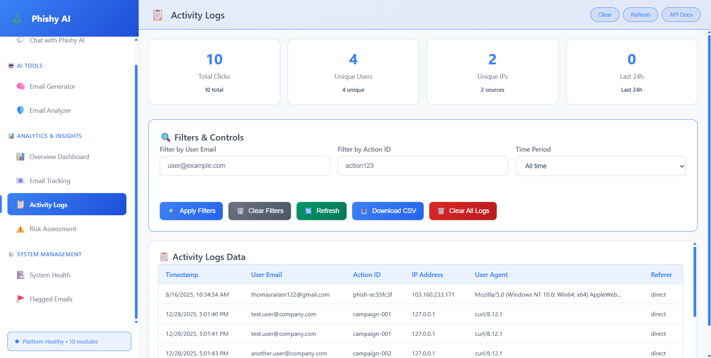

**Activity Logs** provide detailed audit trails:
- Filters by user email, action ID, time period
- Total clicks, unique users, unique IPs
- Downloadable CSV exports
- Detailed logs with timestamps, user emails, action IDs, IP addresses, user agents, and referrers

### Risk Assessment

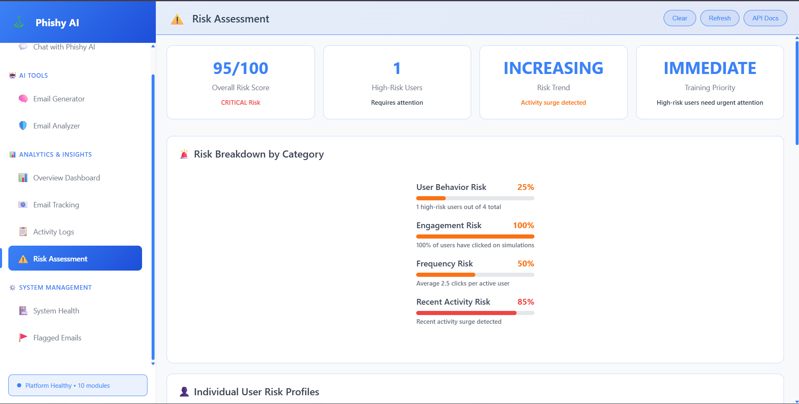

The **Risk Assessment** module calculates overall security posture:
- Overall risk score (0-100) with severity classification
- High-risk user counts
- Risk trend analysis (INCREASING, STABLE, DECREASING)
- Training priority recommendations

**Risk Breakdown by Category:**
- User Behavior Risk: Percentage of high-risk users
- Engagement Risk: Percentage who clicked simulations
- Frequency Risk: Average clicks per active user
- Recent Activity Risk: Surge detection

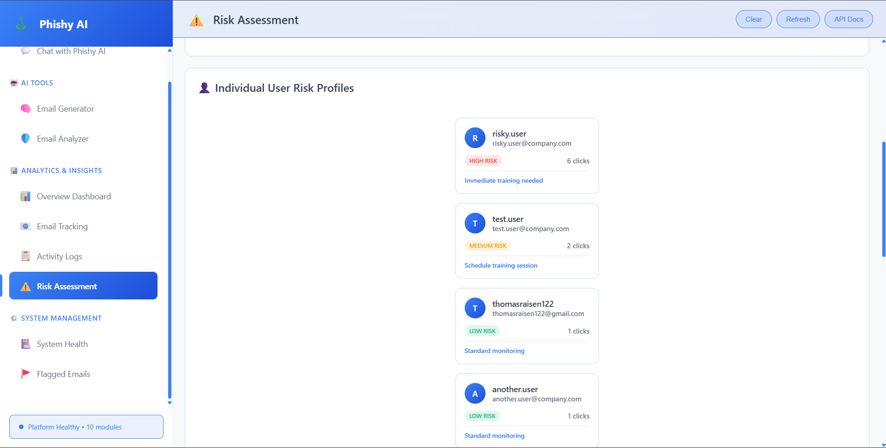

**Individual User Risk Profiles** show personalized assessments:
- User avatars with email addresses
- Risk classification badges (HIGH, MEDIUM, LOW)
- Click counts per user
- Recommended actions (immediate training, group sessions, standard monitoring)

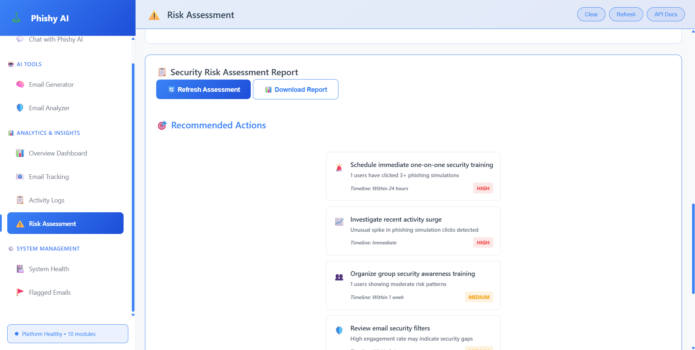

**Security Risk Assessment Report** with downloadable PDF:
- Recommended actions with priority levels and timelines
- Immediate actions flagged as HIGH priority
- Medium and LOW priority recommendations for long-term security

### Chrome Extension

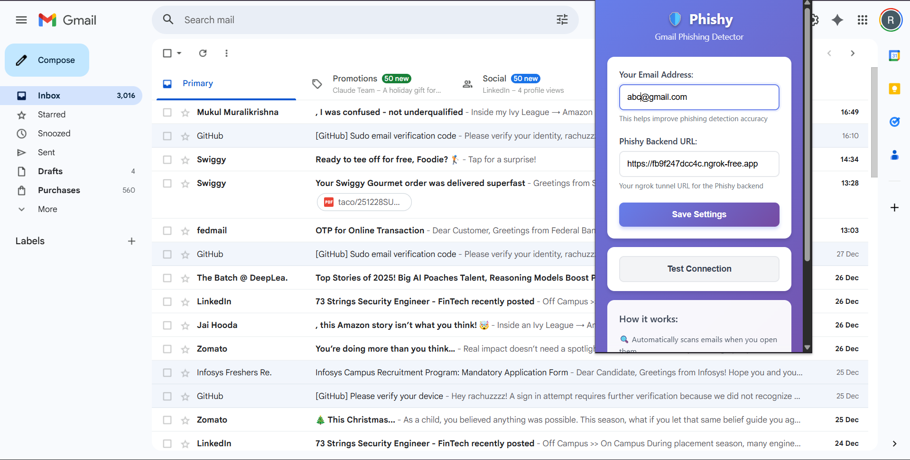

The **Chrome Extension** integrates directly into Gmail:
- Configuration popup for email address and backend URL
- Connection testing
- Automatic email scanning on open
- Inline security analysis displayed in Gmail

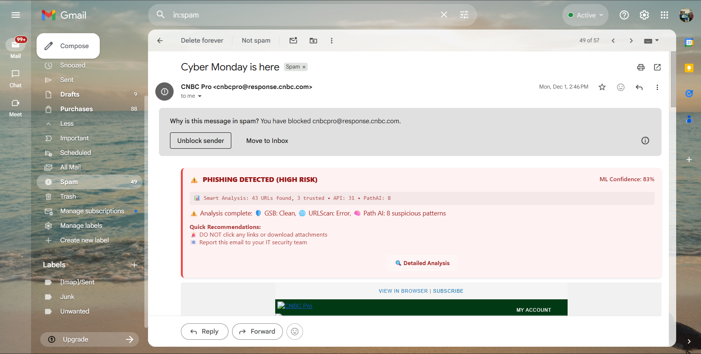

**Real-time Phishing Detection** in Gmail inbox:
- Color-coded risk banners (red = HIGH RISK)
- Smart analysis: URLs found, trusted sources, API indicators
- Phi AI detection of suspicious patterns
- Quick recommendations (don't click links, report to security team)

### Detailed Security Analysis

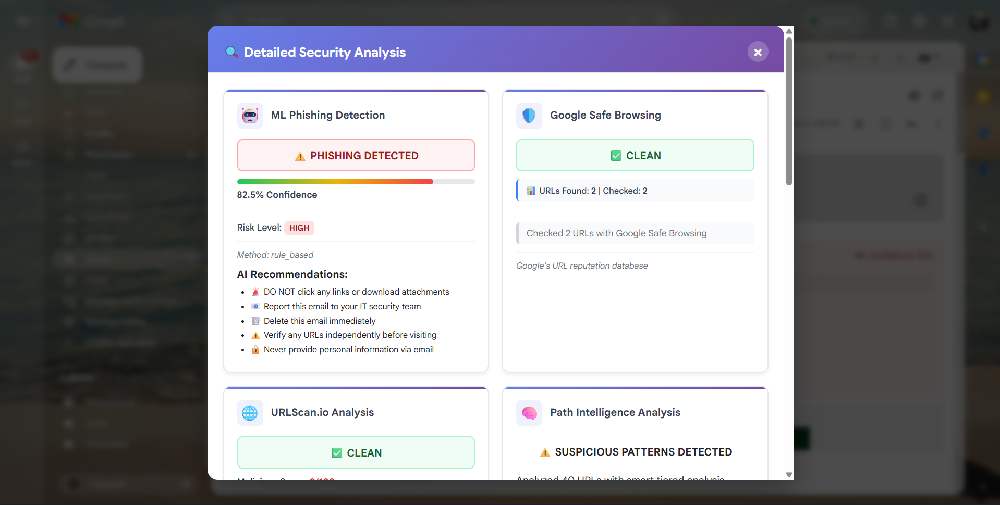

**Detailed Security Analysis Modal** provides multi-signal breakdowns:
- **ML Phishing Detection**: Confidence percentage, risk level, AI recommendations
- **Google Safe Browsing**: URL reputation checks with clean/suspicious status
- **URLScan.io Analysis**: Malicious score, security engine results
- **Path Intelligence Analysis**: Suspicious pattern detection (random paths, obfuscation)

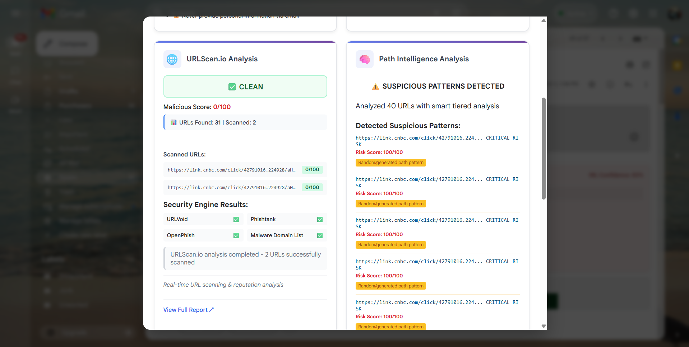

**URLScan.io Integration** shows:
- Scanned URLs with malicious scores (0/100)
- Security engine results (URLVoid, OpenPhish, Malware Domain List, Phishtank)
- Real-time URL scanning and reputation analysis

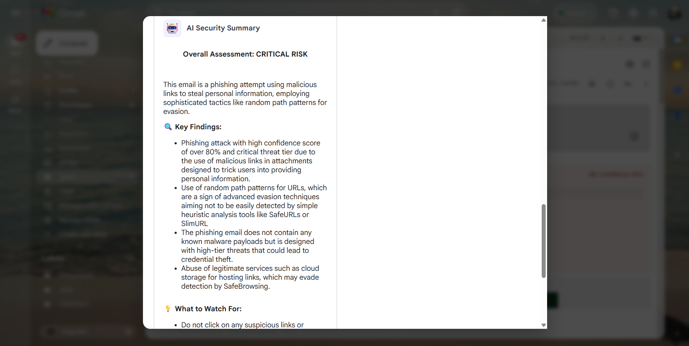

**AI Security Summary** provides explainable analysis:
- Overall assessment (CRITICAL RISK, HIGH, MEDIUM, LOW)
- Key findings explaining WHY an email is dangerous
- Detection of sophisticated evasion tactics
- Warnings about credential theft, malware, and social engineering

---

## 📚 API Endpoints

### Core Analysis

| Endpoint | Method | Description |
|----------|--------|-------------|
| `/comprehensive/analyze` | POST | Multi-signal email analysis |
| `/detector/analyze` | POST | ML classification only |
| `/llm/generate-email` | POST | Generate phishing email |
| `/smtp/send-email` | POST | Send email via SMTP |

### Tracking & Analytics

| Endpoint | Method | Description |
|----------|--------|-------------|
| `/track/click` | GET | Track email click |
| `/track/stats` | GET | Campaign statistics |
| `/analytics/analyze` | GET | Detailed analytics |
| `/forecast/predict` | GET | Time-series forecasting |

### System

| Endpoint | Method | Description |
|----------|--------|-------------|
| `/health` | GET | Health check |
| `/docs` | GET | Swagger API docs |
| `/redoc` | GET | ReDoc API docs |

**Full API documentation**: `http://localhost:8080/docs`

---

## 📁 Project Structure

```
Phishy/
├── backend/
│   ├── app.py                        # FastAPI application
│   ├── routes/
│   │   ├── comprehensive_analysis.py # Multi-signal analysis (43KB)
│   │   ├── llm_generator.py          # AI email generation (60KB)
│   │   ├── phishing_detector.py      # ML classification (18KB)
│   │   ├── smtp_sender.py            # Email sending (14KB)
│   │   ├── analytics.py              # Campaign analytics (29KB)
│   │   ├── click_tracker.py          # Click tracking (12KB)
│   │   ├── forecast.py               # Time-series prediction (22KB)
│   │   ├── smart_query_handler.py    # Query routing (20KB)
│   │   ├── email_flagging.py         # Flagging system (26KB)
│   │   └── ... (15 modules total)
│   ├── data/
│   │   ├── click_logs.csv            # Click tracking logs
│   │   └── intent_dataset.csv        # ML training data
│   └── logs/
│       └── phishy_app.log            # Application logs
│
├── frontend/
│   ├── index.html                    # Main UI (328KB)
│   └── *.png                         # Assets
│
├── chrome-extension/
│   ├── manifest.json                 # Extension manifest (V3)
│   ├── content.js                    # Gmail scanner (81KB)
│   ├── background.js                 # Service worker (2KB)
│   └── popup.html/js/css             # Settings UI
│
└── start.bat                         # Unified startup script

Total: 15 Route Modules | 79 API Endpoints | 500KB+ Backend Code
```

---

## 🏗️ Architecture

```
┌────────────────────────────────────────────────────────────┐
│                    PHISHY PLATFORM                         │
├────────────────────────────────────────────────────────────┤
│                                                            │
│  👤 USER INTERFACES                                        │
│  ├─ Web Dashboard (Port 3001)                             │
│  └─ Chrome Extension (Gmail Integration)                  │
│                         ↓                                  │
│  🌐 NGROK TUNNEL (Optional)                                │
│  └─ ngrok http 8080 → HTTPS URL                           │
│                         ↓                                  │
│  ⚡ FASTAPI APPLICATION (Port 8080)                        │
│  ├─ Email Analysis Routes                                 │
│  ├─ Campaign Management                                    │
│  ├─ Analytics & Tracking                                   │
│  └─ SMTP Integration                                       │
│                         ↓                                  │
│  🧠 MULTI-SIGNAL ANALYSIS LAYER                            │
│  ├─ ML Classification (XGBoost)                           │
│  ├─ Semantic Analysis (Transformers)                      │
│  ├─ URL Safety (URLScan.io, Safe Browsing)               │
│  ├─ IP Reputation (AbuseIPDB)                             │
│  ├─ Header Analysis (SPF/DKIM/DMARC)                     │
│  └─ Explainable AI (Phi-3 Mini LLM)                      │
│                         ↓                                  │
│  💾 DATA & STORAGE                                         │
│  ├─ Click Logs (CSV)                                      │
│  ├─ Campaign Data                                          │
│  └─ ML Models                                              │
│                                                            │
└────────────────────────────────────────────────────────────┘
```

### Analysis Flow

```
Email Input
    ↓
1. ML Classification → Confidence Score (0-100%)
    ↓
2. URL Extraction → Safety Checks (Multiple APIs)
    ↓
3. IP Analysis → Sender Reputation
    ↓
4. Header Analysis → Authentication Status
    ↓
5. LLM Explainability → Human-Readable Reasoning
    ↓
Multi-Signal Risk Report
```

**Key Point**: No single signal determines the verdict. All signals are aggregated and explained.

---

## 🔧 Troubleshooting

### Backend Won't Start

```bash
# Check Python version
python --version  # Needs 3.8+

# Reinstall dependencies
cd backend
pip install -r requirements.txt

# Check port availability
netstat -an | findstr :8080
```

### Email Sending Fails

- Use Gmail **App Password**, not regular password
- Enable 2-factor authentication first
- Test endpoint: `POST /smtp/test-smtp`
- Check logs: `backend/logs/phishy_app.log`

### Chrome Extension Issues

**"Cannot connect to backend"**
- Verify backend running at `http://localhost:8080`
- Ensure ngrok is active
- URL must be HTTPS with no trailing slash
- Test: `https://your-ngrok-url/health`

**Extension not showing analysis**
- Reload Gmail tab (Ctrl+R)
- Check extension enabled in `chrome://extensions/`
- Open console (F12) and look for errors

**ngrok URL changes**
- Free ngrok generates new URLs on restart
- Update extension settings each time
- Consider paid ngrok for static URL

### AI Features Not Working

- Install Ollama: [https://ollama.ai](https://ollama.ai)
- Pull model: `ollama pull phi3:mini`
- Check health: `http://localhost:8080/llm/health`
- System uses fallback templates if unavailable

---

## 🔒 Security & Legal

### ⚠️ Critical Warnings

This platform is for **AUTHORIZED TRAINING ONLY**.

### Legal Requirements

✅ **Before using Phishy:**
- Obtain **written authorization** from organization leadership
- Use only in **controlled training environments**
- Follow all **applicable laws and regulations**
- Inform participants about training nature
- Comply with **anti-phishing laws** in your jurisdiction

### Ethical Use

- All simulations must include educational disclaimers
- Tracking URLs redirect to training materials
- Never use for malicious purposes
- Respect privacy and data protection laws (GDPR/CCPA)
- Implement proper data retention policies
- Provide opt-out mechanisms

### Data Handling

- Click logs contain PII (IP addresses, user agents)
- Encrypt data at rest and in transit
- Anonymize data where possible
- Implement access controls
- Regular security audits recommended

---

## 📜 License

**Educational and Training Use Only**

This project is provided for cybersecurity education and authorized training purposes.

**You may:**
- Use for internal security training
- Conduct authorized phishing simulations
- Study and learn from the code

**You may NOT:**
- Use for malicious purposes
- Conduct unauthorized simulations
- Deploy without proper authorization
- Use for commercial purposes without permission

**Disclaimer:**
The authors are not responsible for misuse of this software. Users must ensure compliance with all applicable laws, regulations, and organizational policies.

---

## 📞 Documentation & Support

**API Documentation**: `http://localhost:8080/docs`
**Health Check**: `http://localhost:8080/health`
**Training Page**: `http://localhost:8080/training/phishing-awareness.html`

### Testing

```bash
# Backend health
curl http://localhost:8080/health

# List phishing scenarios
curl http://localhost:8080/llm/scenarios

# View click statistics
curl http://localhost:8080/track/stats
```

---

<div align="center">

**Built with ❤️ for Cybersecurity Education**

⚠️ **Use Responsibly** | 🎓 **Train Ethically** | 🛡️ **Secure Properly**

*Remember: Email security is not binary. Always evaluate multiple signals.*

---

**[Report Issues](https://github.com/rachuzzzz/Phishy/issues)** • **[View Source](https://github.com/rachuzzzz/Phishy)**

</div>
